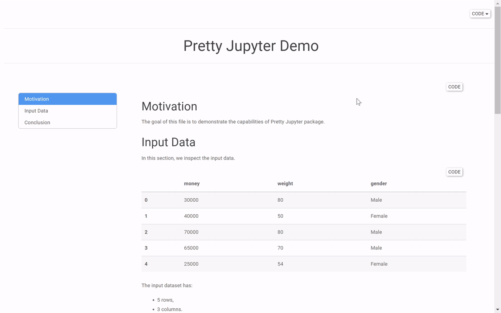

<h1 align="center">
  <br>
  Pretty Jupyter
  </br>
</h1>
<h4 align="center">Simple package for beautiful & dynamic reports</h4>

<p align="center">
  <a href="https://github.com/JanPalasek/pretty-jupyter/actions/workflows/ci.yml/badge.svg"></a>
  <a href="https://img.shields.io/github/v/release/JanPalasek/pretty-jupyter"></a>
  <a href='https://pretty-jupyter.readthedocs.io/en/latest/?badge=latest'>
</a>
</p>

<p align="center">
  
</p>

## Introduction

Pretty Jupyter is a package that creates beautifully styled and dynamic html webpage from Jupyter notebook.

Check out the **[demo](http://janpalasek.com/pretty-jupyter-example.html)** and compare it with the [default jupyter](http://janpalasek.com/classic-jupyter-example.html). You can try Pretty Jupyter [online](http://janpalasek.com/pretty-jupyter.html).

## Main Features

- :point_right: Visually appealing styles.
- :point_right: Automatic Table of Contents generation.
- :point_right: Using Python variables in Markdown.
- :point_right: Tabsets: Tabs that hold section content inside them.
- :point_right: Code Folding: Show/Hide code to filter out unnecessary content.

All these features are integrated directly in the output html page. Therefore there is no need for an interpreter running in the backend.

## Installation

```sh
python -m pip install pretty-jupyter
```

## Usage

```sh
jupyter nbconvert --to html --template pj ${PATH_TO_IPYNB}
```

To unlock the full potential of Pretty Jupyter, see [the customization section](https://github.com/JanPalasek/pretty-jupyter/wiki/2.-Customization) in the documentation.

## Documentation

- [Documentation](https://pretty-jupyter.readthedocs.io/)
- [Examples](https://github.com/JanPalasek/pretty-jupyter-examples)

## Credits

* **nbconvert**: Pretty Jupyter uses nbconvert underhood. Its great extendability allowed this project to be created.
* **RMarkdown**: RMarkdown served as a great inspiration when making this package.
