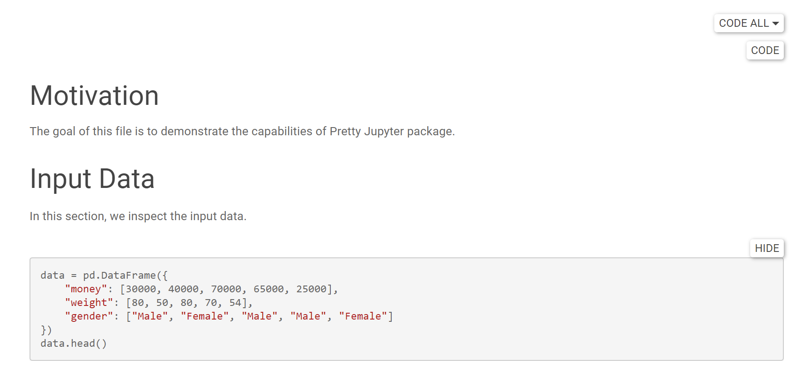

Code Folding
================

Code Folding is a functionality that allows us to show or hide input of the code cells. This allows us to reduce the visual clutter on the output page.

.. _code-folding-figure:

    Figure: Code Folding

By pressing Hide (Show resp.) the code disappears (appears resp.).

Code Folding can be set up by specifying the following attributes in the metadata (see :ref:`Metadata:Notebook-level Metadata` page). The available settings are:

* ``code_folding: show``: Code Folding is enabled and all cells are shown at the beginning.
* ``code_folding: hide``: Code Folding is enabled and all cells are hidden at the beginning. **This is a default behavior.**
* ``code_folding: disable``: Code Folding is disabled.

The settings can be also overriden on the cell-level with ``input_fold`` attribute (see :ref:`Metadata:Cell-level Metadata`). The available settings are:

* ``input_fold: hide``: The source code of the cell is hidden at the beginning.
* ``input_fold: show``: The source code of the cell is shown at the beginning.

We can also hide or show all codes using notebook-level metadata ``code_tools``.