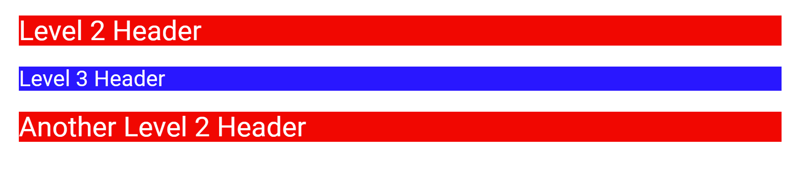

Styling
===============

Basics
--------

We can apply custom styles to modify the page to our needs.

The simplest way to do this is by using ``

    ## Level 2 Header

    ### Level 3 Header

    

    ## Another Level 2 Header

.. _styling-example-figure:

    Figure: Styling example output

Targeting Elements
-------------------------

Pretty Jupyter allows us to add classes and IDs to elements. Usually we do this with markdown elements because basic Markdown doesn't support adding custom classes to them.

The following block demonstrates this as an example. The line below the table adds two classes and specifies the id to the table. Therefore, the output table will have classes custom-class-1 and custom-class-2 and it will have id my-table-id.

.. code-block:: markdown
    :caption: Example: Targeting table.

    | col1 | col2 |
    |------|------|
    | val1 | val2 |

    [//]: # (-.- .custom-class1 .custom-class2 #my-table-id)

We call the line under the table a **token specifier**.

This functionality is not limited for tables. It can be applied to **any** markdown or html element. Even to a paragraph:

.. code-block:: markdown
    :caption: Example: Targeting paragraph.

    This paragraph will be a warning alert.

    [//]: # (-.- .alert .alert-warning)

.. note::

    Markdown automatically creates paragraph elements from the text separated by newlines. Therefore if styling a paragraph, we need to have an empty-line between the text and the token specifier.

.. note::

    **Placing token specifier under the header will modify the section, not the header.** This behavior is used to specify tabsets or headers that are ignored by Table of Contents.

There are a lot of already existing classes from Boostrap 3 or Pretty Jupyter that can be used to make the report prettier. The most interesting ones are listed in :doc:`styling_settings`.

Themes
-------------

We can customize the general theme of the page. To do this, we specify ``theme`` attribute in the notebook's metadata.

For example, to use bootstrap theme, write this in your notebooks metadata:

.. code-block:: yaml

    output:
        html:
            theme: bootstrap

This will include embed your theme directly in the output. The definite list of local supported themes is available in :ref:`styling_settings:Themes` section.

You can also use any other theme compatible with bootstrap 3 and link it as an url.

Examples
--------------------

Check out more examples in our `example repository <https://github.com/JanPalasek/pretty-jupyter-examples>`_.
Themes are specifically demonstrated in **themes** example, where we apply dark theme on a simple notebook.