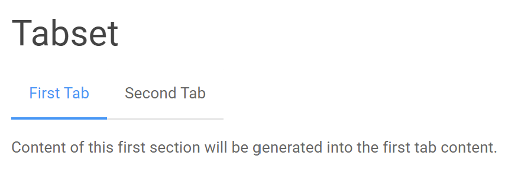
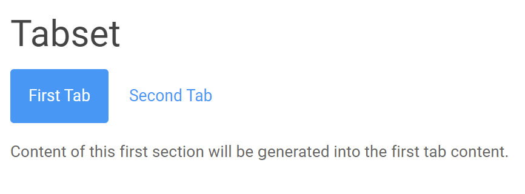

Tabset
================

Pretty Jupyter allows us to generate tabset from the specified sections.
It allows readers to view the content of different sections by clicking the tab header instead of scrolling back and forth on the page.

We can generate a tabset by adding the following line under a header that we want to be a tabset root: ``[//]: # (-.- .tabset)``. We call this line a tabset specifier.

.. note::
    We can also specify tabset without dots, e.g. ``[//]: # (-.- tabset)``. This is only for backward compatibility with previous versions.
    **It is recommended to use the dots**, e.g. ``[//]: # (-.- .tabset)``.

.. _simple-tabset-code:
.. code-block:: markdown
    :caption: Code: Tabset input

    ## Tabset
    [//]: # (-.- .tabset)

    ### First Tab
    Content of this first section will be generated into the first tab content.

    ### Second Tab
    Same goes for the second section.

The output of the tabset is demonstrated in the figure below.

.. _simple-tabset-figure:

    Figure: Tabset output

.. note::
    The content of tabsets don't have to be all in one cell. For example the "First Tab" cell in the :ref:`simple-tabset-code` could be placed in a different cell than "Second Tab" and "Tabset".
    There can be any number of cells between them.

.. note::
    Tabset is also supported in Jinja Markdown cells.

We can also provide an alternative look to the tabset. We can specify ``[//]: # (-.- .tabset .tabset-pills)``, which causes Pretty Jupyter to output tabset below.

.. _tabset-pills-figure:

    Figure: Tabset-pills output

.. note::
    Internally, the tabset specifier adds each token (.tabset, .tabset-pills,...) as a class to the wrapping section.

    This is a specific part of a general mechanism to add classes and id to the elements. It is described in :ref:`styling:Targeting Elements` section.

**In general, the tabs are generated from the child sections of a section that has a tabset specifier under it**. We call such a section a tabset root.
The tabset ends if we specify a section that has same or higher level as the tabset root.

We can use this behavior to our advantage and use an empty header element just to end the tab section and write a text further below.

.. _tabset-trick:
.. code-block:: markdown
    :caption: Code: Tabset trick

    ## Tabset
    [//]: # (-.- .tabset)

    ### First Tab
    Content of this first section will be generated into the first tab content.

    ### Second Tab
    Same goes for the second section.

    ## 
    [//]: # (-.- .unlisted .unnumbered)

    Text that will not appear in the tabs but below them instead.

.. note::

    The header with .unlisted and .unnumbered must have an empty space as the last character on that line. Otherwise
    Markdown to HTML translator will interpret the last # as the header text.

Examples
--------------------

Check out more examples in our `example repository <https://github.com/JanPalasek/pretty-jupyter-examples>`_. Specifically, the tabsets are demonstrated in the following examples:

* **demo**: A simple demo of app functionality. Contains a few tabsets of "pills" type.
* **main-features-demo**: Practical example for a tabset feature.
* **dynamic-tabsets**: Shows how tabset's tabs can be dynamically generated using Jinja Markdown.

