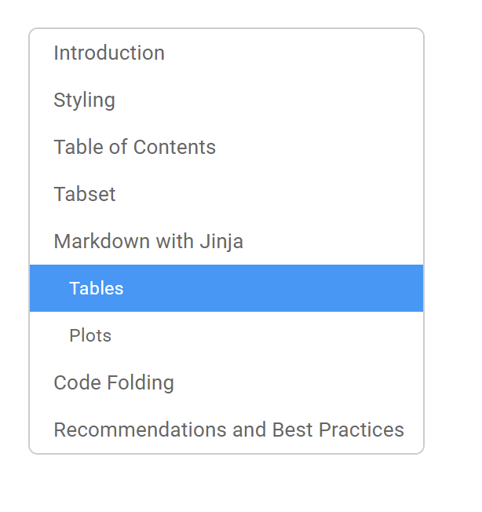

Table of Contents
======================

Pretty Jupyter automatically generates Table of Contents for the page. The table of contents looks as below:

.. _toc-figure:

    Figure: Table of Contents

Each header from the notebook is automatically added to the Table of Contents.
We can prevent a header from being added to the Table of Contents by adding classes ``unlisted`` and ``unnumbered``.
We can do it like this in Markdown:

.. code-block:: markdown
    
    ## 
    [//]: # (-.- .unlisted .unnumbered)

.. note::
    In the code-block above, there is a space after the last #. If we didn't add it, the name wouldn't be empty.
    Instead, its name would be "#".

To turn off Table of Contents functionality completely, we need to add the following property to the notebook-level metadata: ``toc: false``.

Examples
--------------------

Check out more examples in our `example repository <https://github.com/JanPalasek/pretty-jupyter-examples>`_. Specifically, the TOC are demonstrated in the following example:

* **main-features-demo**: Shows, how Table of Contents was generated.